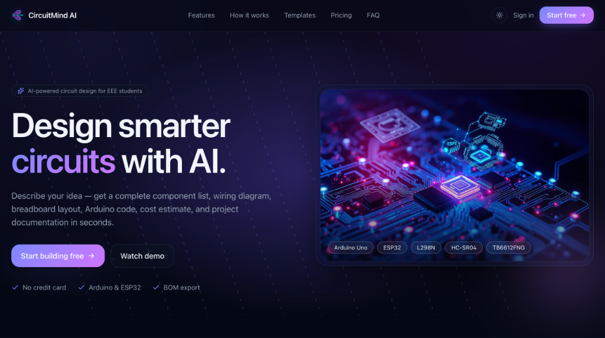
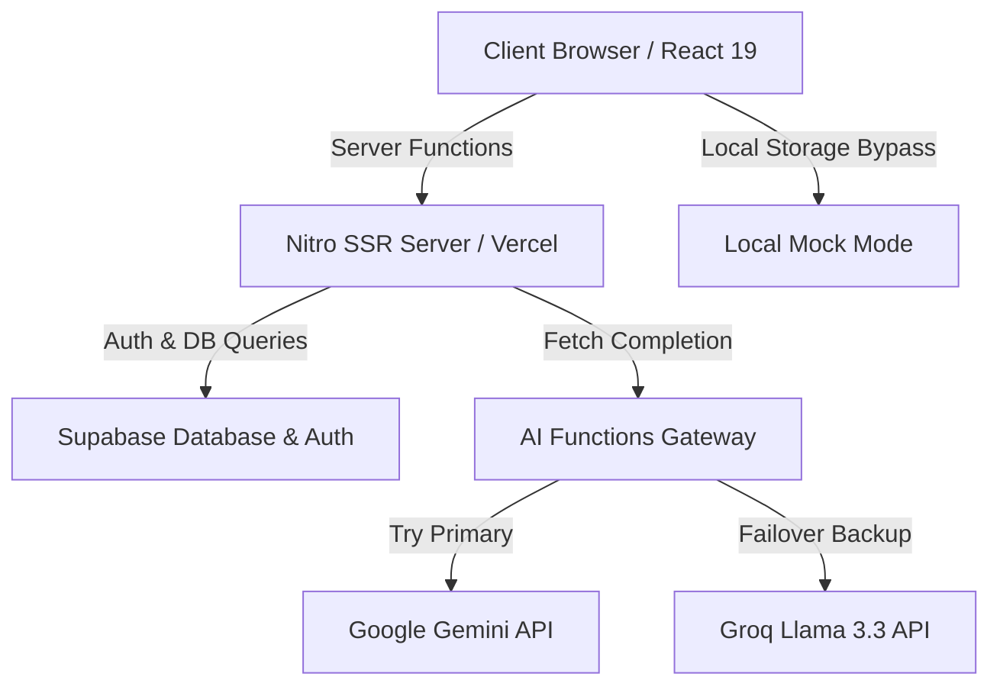

<div align="center">

# ⚡ CircuitMind AI

### *Convert Natural Language into Production-Ready Electronic Schematics and Code*

[](LICENSE)
[](#)
[](#)
[](#)
[](#)
[](#)

---

<p align="center">
  
</p>

[**Explore the Live Demo**](https://circuitmind-ai.vercel.app) • [**Watch Demo Video**](#) • [**Report a Bug**](https://github.com/dev-ahanaf/circuitmind-ai/issues)

</div>

---

## 📽️ Demo

<div align="center">
  <table>
    <tr>
      <td width="50%" align="center">
        <strong>💡 Prompt to Schematic GIF</strong><br><br>
        
      </td>
      <td width="50%" align="center">
        <strong>🔌 Interactive Workspace Preview</strong><br><br>
        
      </td>
    </tr>
  </table>
</div>

---

## 📖 Overview

Designing electronics projects traditionally requires navigating scattered pinout diagrams, writing microcontroller code from scratch, manually calculating component budgets, and configuring CAD layout packages. 

**CircuitMind AI** is an AI-powered Electronics Design Automation (EDA) workspace that transforms natural language descriptions into complete, structured electronic designs in seconds. It bridges the gap between conceptualizing an idea and building it on a breadboard.

### 🌟 Problems Solved:
1. **Reduces Breadboard Hookup Errors**: Generates explicit connection tables detailing MCU pins to component pins.
2. **Eliminates Code Cold-Starts**: Provides compilation-ready Arduino/ESP32 starter code tailored to the generated pinout.
3. **Streamlines Part Procurement**: Estimates component prices and builds a dynamic Bill of Materials (BOM) with low-power and budget optimization options.
4. **Simplifies Documentation**: Packs schematics, code, safety guidelines, and wiring instructions into a downloadable PDF report.

---

## ❓ Why CircuitMind AI?

Traditional CAD tools (like KiCad or Eagle) are powerful but have steep learning curves and require manual component mapping. General-purpose AI assistants can answer engineering questions but cannot visualize circuits or structure output format reliably. 

CircuitMind AI combines **LLM reasoning** with a **structured CAD rendering engine**:
* **Deterministic Circuit Schema**: Rather than just outputting raw text, the system prompts the AI to generate a validated JSON structure mapping components and connection nodes.
* **Dynamic Visualization**: Reads the structured JSON schema and renders a dynamic, interactive circuit diagram on the web canvas automatically.
* **Cost & Power Optimization**: Built-in algorithm fallbacks to audit component lists and recommend optimizations (e.g., swapping a high-cost microcontroller for an ESP32, or using I2C protocols to reduce wire density).

---

## ✨ Features

| Feature | Description | Icon |
| :--- | :--- | :---: |
| **AI Circuit Generation** | Convert natural language prompts into complete, verified circuit layouts. | 🤖 |
| **Interactive Workspace** | A visual CAD canvas for browsing, arranging, and analyzing components. | 🔌 |
| **Arduino & ESP32 Code** | Automatically generate clean, well-commented code matching the pin configurations. | 💻 |
| **Smart BOM & Optimizer** | Calculate approximate costs and suggest cheaper or lower-power alternatives. | 📊 |
| **Wiring & Connections** | Automatically maps MCU pins to corresponding sensor and actuator pins. | 🔗 |
| **Assembly & Safety Guides** | Step-by-step setup checklists and warnings for power, voltage, and polarity. | 🛠️ |
| **Multi-LLM API Gateway** | Primary client generation using Google Gemini with silent failovers to Groq Llama 3.3. | ⚡ |
| **PDF Report Exporter** | Turn AI designs, code, and schematics into clean, printable vector PDF files. | 📄 |
| **Supabase Authentication** | Secure user login, project saving, and customizable student engineering profiles. | 🔑 |

---

## ⚙️ How It Works

1. **Input Prompt**: The user describes their engineering idea (e.g., *"Line following robot using ESP32 and 3 IR sensors"*).
2. **Dual-Model Gateway**: The system sends the prompt through our server functions to the primary **Gemini API**. If rate-limited or blocked, it seamlessly falls back to **Groq's Llama 3.3 70B** to construct the response.
3. **Structured Extraction**: The gateway parses the response. The markdown portions populate the tabs, while the JSON codeblock is loaded into the **CircuitRenderer** component.
4. **Workspace Hydration**: The interactive canvas draws the nodes and routes the wires, generating a clean schematic representation.



---

## 📸 Screenshots

<details>
<summary>🔍 Expand to View Screenshots Placeholders</summary>
<br>

#### 1. Home Dashboard


#### 2. AI Generation Form


#### 3. Interactive CAD Workspace


#### 4. Generated Arduino Code editor


#### 5. Bill of Materials (BOM) & Optimizer


#### 6. Printable PDF Report Export


#### 7. Mobile View Responsiveness


</details>

---

## 🛠️ Tech Stack

### Frontend & Styling
| Technology | Description | Badge |
| :--- | :--- | :--- |
| **React 19** | User interface components and hooks |  |
| **TypeScript** | Type-safe application development |  |
| **TanStack Start** | Full-stack SSR routing and state hydration |  |
| **Tailwind CSS v4** | Rapid UI styling and design utilities |  |
| **Shadcn UI & Radix** | Accessible design components and primitives |  |

### Backend & AI Gateway
| Technology | Description | Badge |
| :--- | :--- | :--- |
| **Nitro** | High-performance Javascript SSR engine |  |
| **Supabase** | DB storage, JWT authentication, and user profiles |  |
| **Gemini API** | Advanced AI logic & structured schema builder |  |
| **Groq Llama 3.3** | High-throughput open fallback inference |  |

---

## 📂 Folder Structure

```
circuitmind-ai/
├── supabase/                 # Supabase configuration & DB migrations
│   ├── migrations/           # Database migration files
│   └── config.toml           # Supabase CLI configuration
├── src/                      # Application source code
│   ├── assets/               # Static assets & images
│   ├── components/           # Reusable UI & circuit components
│   │   └── CircuitRenderer/  # Visual interactive circuit previewer
│   ├── editor/               # Schematic editor panels & logic
│   ├── integrations/         # Supabase client integration
│   ├── lib/                  # Server functions & AI Gateway client
│   ├── routes/               # TanStack Router page routes
│   │   ├── auth.tsx          # Authentication & setup
│   │   ├── dashboard.tsx     # Workspace layout & navigation
│   │   ├── index.tsx         # Main landing page
│   │   └── ...               # Additional sub-routes
│   ├── utils/                # PDF exporters & markdown parsers
│   ├── client.tsx            # Client-side hydration entry
│   ├── router.tsx            # Router & QueryClient initialization
│   ├── server.ts             # SSR server entry point
│   ├── start.ts              # TanStack Start middleware & instance config
│   └── styles.css            # Tailwind CSS styling imports
├── package.json              # NPM dependencies & scripts
├── vite.config.ts            # Vite & Nitro compilation configuration
└── tsconfig.json             # TypeScript configuration
```

---

## 🚀 Setup & Installation

Follow these steps to set up CircuitMind AI on your local machine:

### 1. Clone the Repository
```bash
git clone https://github.com/dev-ahanaf/circuitmind-ai.git
cd circuitmind-ai
```

### 2. Install Dependencies
```bash
npm install
# or using bun
bun install
```

### 3. Environment Variables Configuration
Create a `.env` file in the root directory and configure it as shown:

```env
# Supabase Configuration (Use your project details)
SUPABASE_PROJECT_ID="your_project_id"
SUPABASE_PUBLISHABLE_KEY="your_supabase_anon_key"
SUPABASE_URL="https://your_project_id.supabase.co"
VITE_SUPABASE_PROJECT_ID="your_project_id"
VITE_SUPABASE_PUBLISHABLE_KEY="your_supabase_anon_key"
VITE_SUPABASE_URL="https://your_project_id.supabase.co"

# AI Gateway API Keys
GEMINI_API_KEY="your_google_gemini_api_key"
GROQ_API_KEY="your_groq_api_key"
```

### 4. Database Schema Setup
Push migrations to your Supabase instance:
```bash
# Link to your remote project
npx supabase link --project-ref your_project_id

# Deploy local schemas and tables
npx supabase db push
```

### 5. Running the Application Locally
To start the local development server:
```bash
npm run dev
# or using bun
bun dev
```
Open your browser and navigate to **`http://localhost:3000`**.

---

## ☁️ Deployment

### Deploying to Vercel
The project is built on TanStack Start and compiles via Vite with a **Nitro Vercel Preset** built-in:
1. Connect your GitHub repository to **Vercel**.
2. Vercel will automatically detect the **TanStack Start** framework build settings.
3. Add your Environment Variables in the project settings on Vercel:
   - `VITE_SUPABASE_URL`
   - `VITE_SUPABASE_PUBLISHABLE_KEY`
   - `GEMINI_API_KEY`
   - `GROQ_API_KEY`
4. Click **Deploy**. Vercel will configure serverless functions for Nitro SSR and host static assets under the Edge network.

---

## 🗺️ Roadmap

- [x] Multi-LLM API Gateway with Gemini primary & Groq backup
- [x] Interactive CAD Schematic workspace canvas
- [x] Custom Student Profiles (Favorite MCU, Field of Study)
- [x] Printable PDF vector report compilation & download
- [x] Full responsive dark/light mode toggle
- [ ] KiCad schematic file (`.kicad_sch`) export exporter
- [ ] Active circuit current and voltage loop simulation
- [ ] Automatic PCB layout routing engine
- [ ] Voice command prompts for hands-free component adjustment

---

## 🔮 Future Vision

The ultimate goal of CircuitMind AI is to become the **"ChatGPT for Electronics Engineering."** 

We want to build a platform where engineers, hobbyists, and students can describe complex multi-layer PCB requirements, run real-time hardware-in-the-loop simulations, resolve impedance matching calculations automatically, and download complete manufacturing files (Gerbers, BOMs, CPLs) using natural language alone.

---

## 🤝 Contributing

We welcome contributions from engineering students, makers, and web developers!

1. Fork the Project.
2. Create your Feature Branch (`git checkout -b feature/AmazingFeature`).
3. Commit your Changes (`git commit -m 'Add some AmazingFeature'`).
4. Push to the Branch (`git push origin feature/AmazingFeature`).
5. Open a Pull Request.

---

## 📄 License

Distributed under the MIT License. See [LICENSE](LICENSE) for more information.

---

## 👤 Author

Developed by **[Ahanaf](https://github.com/dev-ahanaf)**
* Email: [ahanaffayek@gmail.com](mailto:ahanaffayek@gmail.com)
* GitHub: [@dev-ahanaf](https://github.com/dev-ahanaf)

---

## 💖 Acknowledgements

*   [Google Gemini API](https://ai.google.dev/)
*   [Groq API Cloud](https://wow.groq.com/)
*   [Supabase Auth & Database](https://supabase.com/)
*   [TanStack Router & Start](https://tanstack.com/)
*   [Tailwind CSS Team](https://tailwindcss.com/)
*   [Shadcn UI](https://ui.shadcn.com/)
